# Markdown
Markdown desde cero

## ¿Qué es Markdown?

Es un lenguaje de marcado, markdown puede convertirse en HTML.
Existen herramientas que hacen esta conversión, como es el caso de dillinger.

[Enlace](https://dillinger.io/)

En dicha herramienta tendremos la pantalla dividida en dos, a la izquierda tendremos nuestro codigo en Markdown, y a la derecha tendremos ese código convertido con las etiquetas propias de HTML.

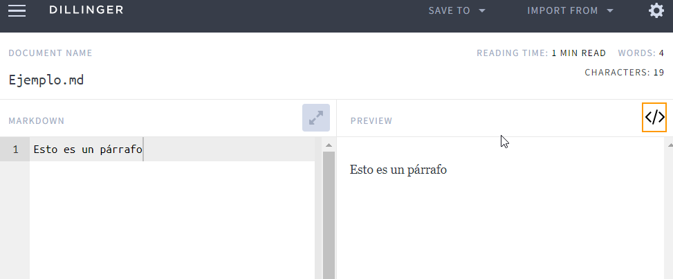

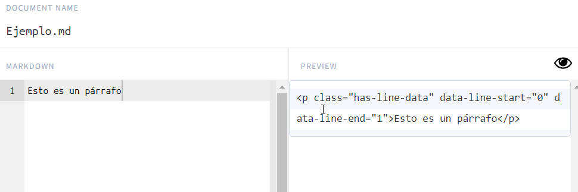  

Cuando seguimos escribiendo en el siguiente renglón, en realidad estamos haciendo  un ``<br>``, entonces si queremos un cambio de párrafo se debe dar dos saltos.

## Sintaxis
Markdown tiene su propia sintaxis, para lograr tener ciertas etiquetas, como es el caso de los encabezados.

### Encabezados

h1 -> #
h2 -> ##
h3 -> ###
h4 -> ####

Markdown entiende que esos titulos tendran id, como veremos en la captura siguiente:

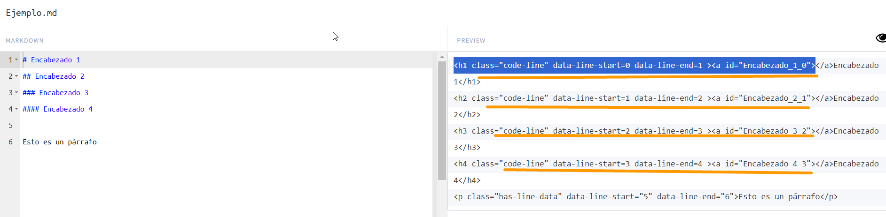  

### Listas
Las listas tambien tienen su propia sintaxis, hay que recordar que en HTML, una lista desordenada se representa con ``<ul> </ul>``.


  

Como podemos notar, si dejamos espacio entre el * (asterisco) y el inicio del texto, podremos anidar dicha lista.

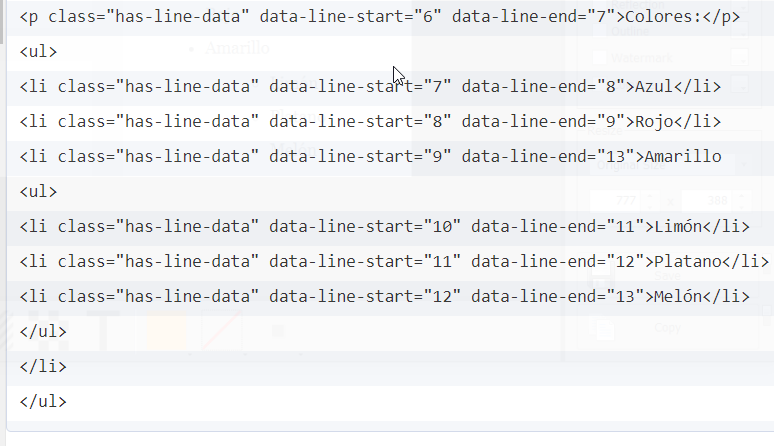  

Si quisieramos listas ordenadas su sintaxis es bastante sencilla, solo tendriamos que colocar los numeros que deseamos.

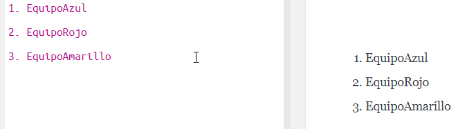  

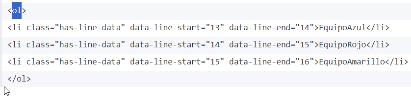  

### Imagenes

La sintaxis para las imagenes varian bastante con lo visto con anterioridad.

````

El texto alternativo debemos recordar que es una buena práctica colocarlo.  

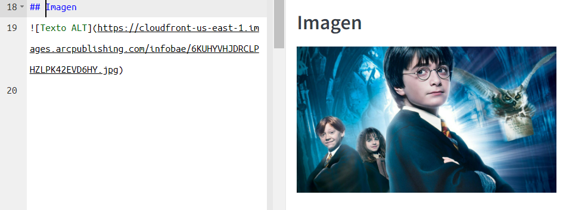  

Mientras que en el código HTML, se mostrara lo siguiente.

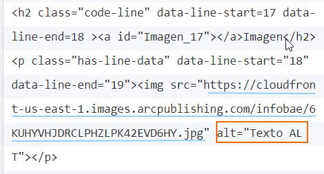  

### Enlaces

La forma de colocar enlaces es muy similar, solamente se elimina el signo de explamación.

``[titulo que se muestra](ENLACE)``

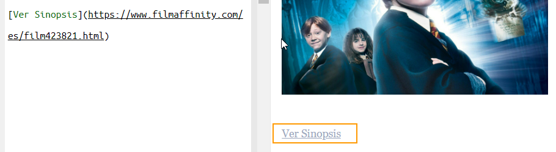  

Como podemos ver, es bastante sencillo colocar un enlace.  

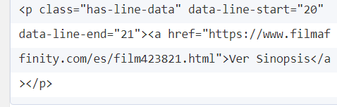  

Hay atajos para poder poner enlaces de manera consecutiva y para ello solo debemos poner corchetes en aquellas palabras, que deseamos que nos retorne a un enlace y posteriormente, en un parrafo aparte, hacer una asignación.


Ejemplo:

``[Pelicula] : enlace.com``

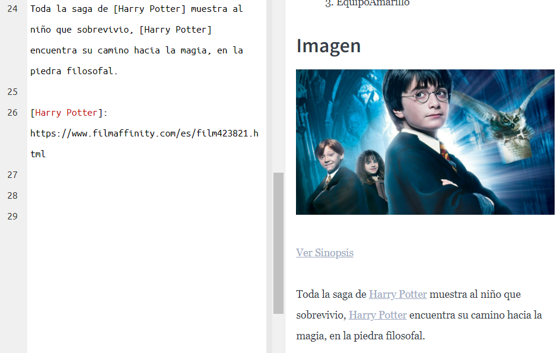  

En este caso se guarda unicamente en el Markdown, sin verse repetido. Se puede hacer de manera analoga con la imagen para los enlaces.

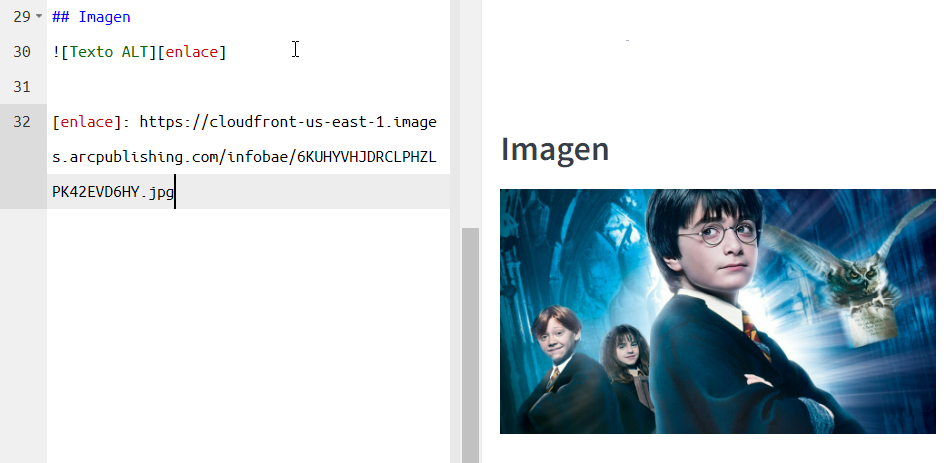  

### Código

Para insertar código se debe usar palabas reservadas, como es el caso de las variables  se pone entre comillas.

  

Para un bloque de codigo completo se utiliza las mismas comillas  pero serian tres de abertura y tres de cierre, además se puede aclarar el lenguaje del que se trata.

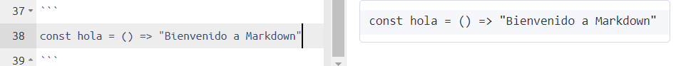  


Cuando se coloca el lenguaje concreto que tenemos en el bloque, podemos ver  una mejor presentación.

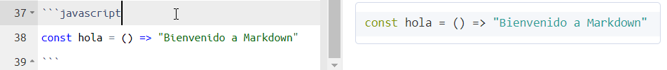  

El código de este bloque queda de la siguiente forma:

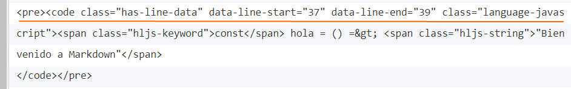  

Una libreria recomendada es la siguiente:

[Enlace para colorear código](https://prismjs.com/)  


Esto se usa para poder colorear el código de markdown, para ello se utiliza el css y js.


### Estilo del texto

Para escribir en negrita, se utiliza doble asterisco al inicio y al final. 


#### Negrita

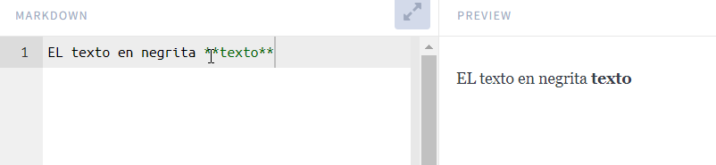  


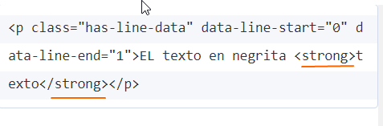  

Para colocar el texto en estilo italica, se necesita tres astericos de abertura y otros tres de cierre.

#### Italica

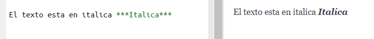  


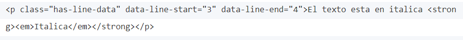  

#### Citas

Para realizar citas unicamente se usa el simbolo de "mayor que", como se muestra en la siguiente imagen.

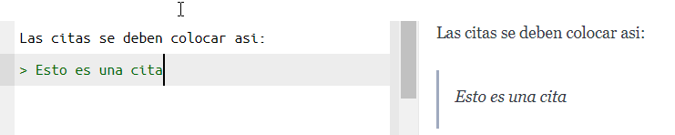  

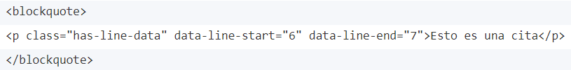  

